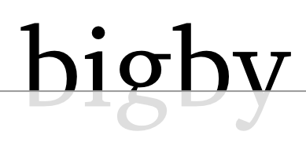

## The Adequately Astonishing HTML5 Game Development Framework!

 [](https://github.com/bigby-framework/bigby/actions) [](https://lerna.js.org/)

### Running the sample game project

```
# Initialize the Bigby monorepo
yarn install
yarn bootstrap
yarn build:all

# Run the example game
cd examples/simple-typescript-game
yarn install
yarn start
```

### Hacking on Bigby

```
yarn install
yarn dev
# open http://localhost:4000
```
